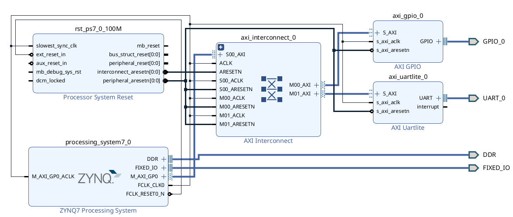

# ZedBoard UART
This repository contain UART and GPIO test ZYNQ project.

> Vivado IDE version: 2022.1

For build use */scripts/**build_project.sh*** or */vivado/**zedboard_uart.xpr*** files.

### Catalogs structure:
 - scripts - .sh and .tcl scripts for build Vivado project (change **vivado_install_path** variable in **build_project.sh** file );
 - src
   - bd - block design files;
   - constraints - pins assignment;
   - hdl - Verilog files;
 - vitis - C-project for ZYNQ;
 - vivado - folder with .xpr file for Vivado GUI-mode;
 - build - folder with scripts running results.